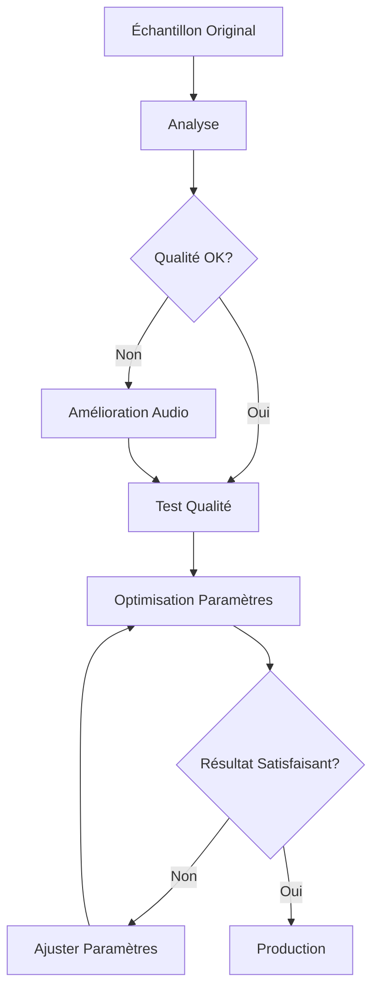

# 🎤 Guide d'Amélioration de la Voix HOPPER

## 📋 Résumé

Ce guide vous accompagne dans l'amélioration de la voix de HOPPER pour obtenir un clonage vocal de qualité professionnelle avec XTTS-v2.

## 🔍 Analyse de la Situation Actuelle

Vous disposez de **5 versions** de l'échantillon vocal Hopper :

| Fichier | Durée | Sample Rate | Canaux | Taille | Recommandation |
|---------|-------|-------------|--------|--------|----------------|
| `Hopper_voix_ultra_clean.wav` | 22.9s | 24kHz | Mono | 1.0 MB | ⭐ **Meilleur choix** |
| `Hopper_voix_clean.wav` | 22.9s | 22.05kHz | Mono | 986 KB | ⭐ **Excellent** |
| `Hopper_voix_24k.wav` | 22.9s | 24kHz | Mono | 1.0 MB | ⭐ **Très bon** |
| `Hopper_voix_hq.wav` | 22.9s | 22.05kHz | Mono | 986 KB | ✅ Bon |
| `Hopper_voix.wav.mp3` | 22.9s | 44.1kHz | Stéréo | 725 KB | ⚠️ À convertir |

### Recommandation immédiate

Utilisez **`Hopper_voix_ultra_clean.wav`** ou **`Hopper_voix_clean.wav`** pour vos générations vocales. Ces versions sont déjà optimisées pour XTTS-v2.

## 🛠️ Outils d'Amélioration

### 1. **Amélioration de l'Échantillon Audio** (`improve_hopper_voice.py`)

Optimise automatiquement votre échantillon vocal :

```bash
# Améliorer l'échantillon original
python improve_hopper_voice.py Hopper_voix.wav.mp3

# Analyser un échantillon
python improve_hopper_voice.py Hopper_voix_clean.wav --analyze-only

# Comparer toutes les versions
python improve_hopper_voice.py --compare
```

**Améliorations appliquées :**
- ✅ Conversion en mono (XTTS-v2 préfère)
- ✅ Réduction de bruit de fond
- ✅ Égalisation pour la voix (300Hz-8kHz)
- ✅ Compression dynamique
- ✅ Normalisation à -16 dBFS
- ✅ Conversion à 22.05kHz (optimal pour XTTS-v2)

### 2. **Optimisation des Paramètres TTS** (`optimize_voice_params.py`)

Teste différentes configurations de génération vocale :

```bash
# Tester toutes les configurations
python optimize_voice_params.py

# Lister les configurations disponibles
python optimize_voice_params.py --list-configs

# Tester une configuration spécifique
python optimize_voice_params.py --config ultra_stable

# Comparer tous les échantillons
python optimize_voice_params.py --compare-samples
```

**5 configurations disponibles :**

1. **Ultra Stable** (Recommandé pour démarrer)
   - Clarté maximale
   - Idéal pour compréhension
   - Temperature: 0.5, Speed: 0.85

2. **Balanced** (Recommandé pour usage général)
   - Bon équilibre naturalité/stabilité
   - Temperature: 0.65, Speed: 0.9

3. **Natural**
   - Plus de variations naturelles
   - Temperature: 0.75, Speed: 1.0

4. **Expressive**
   - Maximum d'émotions
   - Temperature: 0.85, Speed: 1.0

5. **Slow Clear**
   - Parfait pour tutoriels
   - Temperature: 0.6, Speed: 0.8

### 3. **Test de Qualité Rapide** (`test_voice_quality.py`)

Compare rapidement tous vos échantillons :

```bash
python test_voice_quality.py
```

Génère la même phrase avec tous les échantillons disponibles pour faciliter la comparaison.

## 🎯 Plan d'Amélioration en 5 Étapes

### Étape 1 : Analyse
```bash
# Analyser vos échantillons existants
python improve_hopper_voice.py --compare
```

**Action :** Identifiez lequel est déjà le mieux optimisé.

### Étape 2 : Amélioration (si nécessaire)
```bash
# Améliorer l'échantillon original si les versions existantes ne sont pas satisfaisantes
python improve_hopper_voice.py Hopper_voix.wav.mp3 -o Hopper_voix_optimized.wav
```

**Action :** Créez une version ultra-optimisée si besoin.

### Étape 3 : Test de Qualité
```bash
# Tester tous les échantillons avec la même phrase
python test_voice_quality.py
```

**Action :** Écoutez et choisissez le meilleur échantillon.

### Étape 4 : Optimisation des Paramètres
```bash
# Tester différents paramètres avec votre meilleur échantillon
python optimize_voice_params.py --sample Hopper_voix_ultra_clean.wav
```

**Action :** Trouvez la configuration qui sonne le mieux.

### Étape 5 : Application
Mettez à jour `test_voice_clone.py` avec vos meilleurs paramètres.

## 📊 Paramètres Clés Expliqués

| Paramètre | Effet | Valeurs recommandées |
|-----------|-------|---------------------|
| **temperature** | Créativité vs Stabilité | 0.5-0.7 (stable) → 0.8-1.0 (expressif) |
| **speed** | Vitesse de parole | 0.8 (lent) → 1.0 (normal) → 1.2 (rapide) |
| **repetition_penalty** | Évite répétitions | 2.0-3.0 (plus haut = moins de répétitions) |
| **top_k** | Diversité de génération | 20-50 (plus bas = plus stable) |
| **top_p** | Nucleus sampling | 0.7-0.85 (plus bas = plus prévisible) |

## 🎵 Critères de Qualité Vocale

Lors de l'écoute des tests, évaluez selon ces critères :

### ⭐ Excellent
- Voix claire et compréhensible
- Prononciation naturelle
- Pas d'artefacts audibles
- Bon débit de parole
- Intonation appropriée

### ✅ Acceptable
- Compréhensible mais quelques imperfections
- Légères distorsions occasionnelles
- Débit parfois irrégulier

### ❌ À améliorer
- Difficile à comprendre
- Artefacts audibles (clics, distorsions)
- Voix robotique ou monotone
- Vitesse inappropriée

## 🔧 Résolution de Problèmes

### Problème : Voix robotique ou monotone

**Solutions :**
1. Augmenter `temperature` (0.7 → 0.8)
2. Utiliser configuration "Natural" ou "Expressive"
3. Vérifier la qualité de l'échantillon source

### Problème : Artefacts audio (clics, distorsions)

**Solutions :**
1. Diminuer `temperature` (0.8 → 0.6)
2. Augmenter `repetition_penalty` (2.0 → 3.0)
3. Utiliser configuration "Ultra Stable"
4. Améliorer l'échantillon source avec `improve_hopper_voice.py`

### Problème : Voix difficile à comprendre

**Solutions :**
1. Réduire `speed` (1.0 → 0.85)
2. Utiliser configuration "Slow Clear"
3. Vérifier le niveau sonore de l'échantillon
4. Appliquer réduction de bruit

### Problème : Volume trop faible/élevé

**Solutions :**
```bash
# Normaliser l'échantillon à -16 dBFS
python improve_hopper_voice.py votre_sample.wav --target-level -16.0
```

## 📦 Installation des Dépendances

### Pour l'amélioration audio
```bash
pip install pydub loguru noisereduce scipy soundfile
```

### Pour le TTS
```bash
# Environnement Python 3.11 requis
./venv_tts/bin/pip install TTS torch torchaudio
```

## 🎬 Workflow Recommandé



## 💡 Conseils d'Expert

### Pour un échantillon de qualité optimale

1. **Enregistrement :**
   - Environnement calme (pas de bruit de fond)
   - Micro de qualité
   - Parler naturellement, sans forcer
   - 10-20 secondes de parole variée

2. **Préparation :**
   - Format WAV non compressé
   - Mono, 22.05kHz ou 24kHz
   - Niveau normalisé (-16 dBFS)
   - Sans silences longs au début/fin

3. **Génération :**
   - Commencer avec config "Balanced"
   - Ajuster selon vos besoins
   - Tester sur différentes phrases

### Pour une voix professionnelle

- Utilisez `Hopper_voix_ultra_clean.wav` comme base
- Configuration "Balanced" pour usage général
- Configuration "Slow Clear" pour tutoriels/explications
- Configuration "Expressive" pour interactions naturelles

## 📈 Métriques de Succès

Votre amélioration est réussie si :

- ✅ Clarté : Chaque mot est compréhensible
- ✅ Naturalité : La voix sonne humaine, pas robotique
- ✅ Consistance : Qualité stable sur différentes phrases
- ✅ Émotion : Capable d'exprimer différentes tonalités
- ✅ Performance : Génération rapide (<5s par phrase)

## 🚀 Prochaines Étapes

1. Exécutez les 3 scripts d'amélioration
2. Comparez les résultats audio
3. Choisissez votre configuration favorite
4. Mettez à jour `test_voice_clone.py`
5. Intégrez dans votre pipeline de production

## 📚 Ressources Additionnelles

- [Documentation Coqui TTS](https://docs.coqui.ai/)
- [Guide de Clonage Vocal](../VOICE_CLONING.md)
- [XTTS-v2 Research Paper](https://arxiv.org/abs/2310.19889)

---

**Besoin d'aide ?** Consultez le [TROUBLESHOOTING.md](../TROUBLESHOOTING.md) ou ouvrez une issue GitHub.
